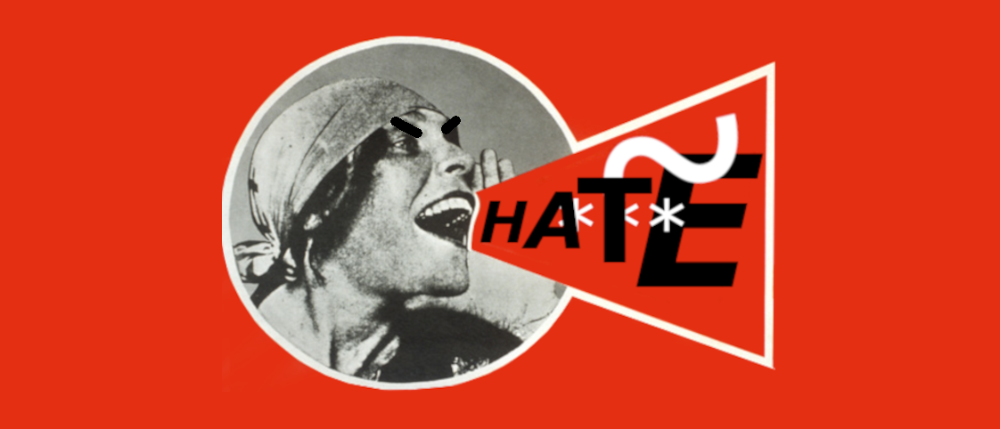

# hatespeech

The tool gets tweets in streaming and does some simple NLP elaboration of them. The tool is aimed at:
1. collect examples of hate speech;
2. create a hate speech testing system, which will allow detecting if a given text represents this kind of discursivity;
3. study the structure of quarrel conversation.
